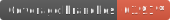
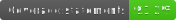

# Flowbuild API





API layer for flowbuild environment.

# Run on your localhost:
* Setup:
```
pnpm i
pnpm run prepare
```
* Running:
```
pnpm run start:dev    # will run ts-node
```
or
```
pnpm run build
pnpm run start
```

## Run REDIS and KEYCLOAK through docker-compose file:
```
docker-compose up --build
```

## Unit tests:
The test scripts are:
```
pnpm run test
pnpm run test:cov
pnpm run test:badges
```

## Load testing on JMETER:
See ```./load``` for a reference test flow.

To get application behavior, you might use climem (reference: https://www.npmjs.com/package/climem)

It's a quick setup:
```
pnpm i climem -D
export CLIMEM=8999 && ts-node -r climem -r tsconfig-paths/register ./src/app.ts
```

To see memory usage:
```
climem 8999 localhost
```

## Swagger:
You may find swagger on route: 
```
/docs
```

## Authentication:
Flowbuild-API uses a own generated token (HS256) and may also use external configurations for token validations (RS256).

For "external" validations, Keycloak was used as a reference and it is currently provisioned on ```docker-compose.yml```.

For more information on Keycloak configuration, see the docs [here](https://github.com/imagure/flowbuild-poc-modules/tree/master/docs/keycloak). 
